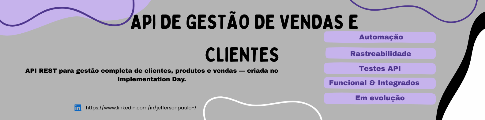



# Gestão de Vendas e Clientes (API)

API REST em evolução para microempreendedores controlarem clientes, produtos e vendas. Projeto iniciado em um Implementation Day e mantido como portfólio em desenvolvimento, com foco em regras de negócio, segurança e qualidade automatizada.

## Status do MVP e foco atual
- Status: em andamento (armazenamento em memória, sem persistência ainda).
- Foco: hardening de segurança (hash de senhas, rate limiting) e persistência em banco; habilitar pipeline CI/CD.
- Qualidade: suíte de testes Mocha/Chai/Supertest; primeiros testes manuais em entrega (QA).
- Planejamento: backlog público em Issues e board "Gestão de Empreendedores e Faturamento" — https://github.com/users/jeff-barbosa123/projects/6

## Destaques do produto
- Autenticação JWT com bloqueio após 3 tentativas (15 min), expiração por inatividade (30 min) e logout que revoga tokens.
- CRUD de clientes e produtos com validação e e-mail único.
- Registro e cancelamento de vendas; faturamento diário, semanal e mensal com filtros por período.
- Relatórios exportáveis em CSV, PDF ou Excel; Swagger interativo em `/api-docs`.
- MVP em memória para acelerar iteração e demonstração.

## Stack e arquitetura
- Node.js 18+, Express, CORS, JWT, Swagger UI, PDFKit, uuid.
- Camadas: routes → controllers → services → models + middleware (auth/erros).
- Swagger: `api/resources/swagger.json`, servido via `/api-docs`.

## Endpoints principais
- Auth: `POST /api/auth/login`, `POST /api/auth/logout`
- Clientes: `GET|POST /api/customers`, `PUT|DELETE /api/customers/:id`
- Produtos: `GET|POST /api/products`, `PUT|DELETE /api/products/:id`
- Vendas: `GET|POST /api/sales`, `PUT /api/sales/:id`, `DELETE /api/sales/:id`
- Relatórios: `GET /api/reports/revenue`, `GET /api/reports/revenue/export?format=csv|pdf|excel`

## Execução local
1) Pré-requisitos: Node.js 18+ e npm.
2) Clone o repositório:
```bash
git clone https://github.com/jeff-barbosa123/gestao-vendas-clientes-api.git
cd gestao-vendas-clientes-api
```
3) Instale dependências:
```bash
npm install
```
4) Crie `.env` (raiz ou `api/.env`):
```env
PORT=3000
JWT_SECRET=sua_chave_segura
BASE_URL=http://localhost:3000/api
ADMIN_EMAIL=admin@negocio.com
ADMIN_PASSWORD=admin123
```
5) Rode a API:
- Desenvolvimento: `npm run dev`
- Produção/local: `npm start`

- Base: `http://localhost:3000/api`
- Swagger: `http://localhost:3000/api-docs`
- Credenciais demo: `admin@negocio.com` / `admin123`

## Documentação e QA
- Escopo de validação: `Documentação/condições de teste.txt`.
- Plano de Teste (Login): `Documentação/Plano_de_Teste_da_Funcionalidade_Login_SGVC.docx`.
- Plano e Estratégia de Testes (MVP 1.0): `Documentação/Plano_e_Estrategia_de_Testes_Adaptada_SGVC(MVP 1.0).docx`.
- Plano e Estratégia de Testes (revisão): `Documentação/Plano_e_Estrategia_de_Testes_Adaptada_SGVC.docx` e `Documentação/Plano_e_Estrategia_de_Testes_Adaptada_SGVC.docx.docx`.
- Relatórios de sessão:
  - `Documentação/Relatório_de_Sessão_Funcionalidade_Login_Empreendedores_SGVC.docx`
  - `Documentação/Relatório_de_Sessão_Funcionalidade_Cadastro_de_Clientes_Produtos_SGVC.docx`

## Testes e qualidade
- Testes de API: `npm test`
- Relatório HTML: `npm run test:report` (saída em `api/reports`)
- Testes manuais: primeira entrega em andamento (QA)
- Evidências e planos adicionais: pasta `Documentação/`

## Estrutura de pastas
```
gestao-vendas-clientes-api/
├─ api/
│  ├─ src/
│  │  ├─ routes/          # Rotas da API
│  │  ├─ controllers/     # Orquestra requisições/respostas
│  │  ├─ services/        # Regras de negócio
│  │  ├─ middleware/      # Autenticação e erros
│  │  └─ models/          # Armazenamento em memória (MVP)
│  ├─ test/               # Mocha, Chai, Supertest, fixtures
│  └─ resources/swagger.json
├─ Documentação/          # Evidências e planos de teste
├─ .env.example
└─ README.md
```

## Roadmap (próximas entregas)
- Persistência (Postgres/NoSQL) e migração de dados.
- Hardening de segurança: hash de senhas, rate limiting por IP, logs de auditoria.
- Observabilidade: logs estruturados e métricas; alertas básicos.
- CI/CD: pipeline com lint, testes e publicação de relatórios.
- Analytics/finanças: dashboard de faturamento e CMV avançado.

## Autor
Jefferson Barbosa — Técnico de Qualidade / QA / Automação de Testes  
GitHub: https://github.com/jeff-barbosa123  
LinkedIn: https://www.linkedin.com/in/jeffersonpaulo-
